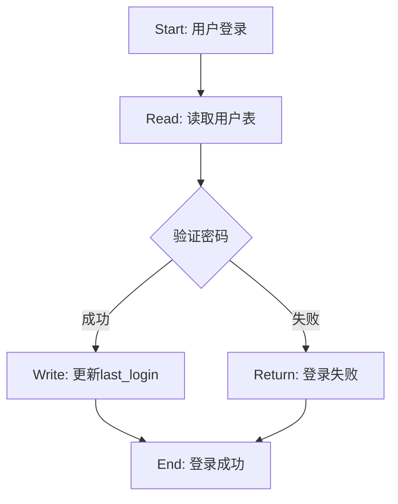

# MindSave v3.0 — Manual Test Specification
# 手工测试规范（实测完整流程）

> 本测试规范为 Markdown 格式的手工测试指南，覆盖 MindSave 全部核心工作流程。
> 适用对象：希望实测 MindSave 的用户、AI Agent 开发者、以及需要验证 MindSave 行为正确性的场景。
> 无需运行脚本，通过对话/命令交互即可完成所有测试。

---

## 测试环境准备

### 前置条件

- 任意 AI 编程助手环境（Trae solo / Claude Code / Cursor 等）
- 目标测试项目目录（建议新建空目录）
- 已正确安装 MindSave（参考 README.md 快速上手）

### 安装步骤

```bash
# 1. 复制运行时规则
cp /path/to/mindsave/CLAUDE.md your-test-project/
cp -r /path/to/mindsave/.mindsave/ your-test-project/

# 2. 复制技能文件（Trae solo 环境）
# 将 /path/to/mindsave/SKILL.md 复制到 skills 目录

# 3. 验证安装
# 在 AI 助手中输入: /snapshots list
# 预期：返回快照列表（当前应为空）
```

### 测试项目初始化

为确保测试独立性，建议使用空目录作为测试项目：

```bash
mkdir -p /tmp/mindsave-test-project
cd /tmp/mindsave-test-project
cp /path/to/mindsave/CLAUDE.md .
mkdir -p .mindsave/snapshots .mindsave/tool_logs .mindsave/workspace_snap .mindsave/execution_graphs
echo '{"snapshots":[]}' > .mindsave/index.json
echo '{"last_save":null,"last_auto_save_time":null,"last_auto_save_turn":0,"tool_calls_since_save":0,"auto_save_count":0,"trigger_reason":null,"pressure_state":"GREEN","thresholds":{"warning":0.60,"critical":0.80},"growth_rate":"normal","complexity":"medium","estimated_tokens_ratio":0.0}' > .mindsave/signal.json
```

---

## 测试用例清单

| 用例编号 | 测试模块 | 用例名称 | 优先级 |
|---------|---------|---------|--------|
| TC-01 | 快照保存 | /save 完整保存流程 | P0 |
| TC-02 | 状态恢复 | /load 正常恢复 | P0 |
| TC-03 | 冷存档检索 | /recall 历史检索 | P1 |
| TC-04 | 快照管理 | /snapshots 列表与统计 | P1 |
| TC-05 | 快照管理 | /snapshots 清理 | P1 |
| TC-06 | 自适应阈值 | 动态阈值计算验证 | P1 |
| TC-07 | 自动触发 | 工具调用阈值触发 | P2 |
| TC-08 | 自动触发 | 会话结束自动保存 | P2 |
| TC-09 | 快照选择 | 多快照选择逻辑 | P1 |
| TC-10 | 验证模式 | /load --verify 一致性检查 | P2 |
| TC-11 | 抗干扰冷却 | 5分钟/10轮冷却验证 | P2 |
| TC-12 | 快照清理 | 20个上限 + 30天过期清理 | P2 |

---

## TC-01：/save 完整保存流程

### 测试目标

验证 `/save` 命令正确生成三层快照，并更新索引文件。

### 预置条件

- 测试项目已初始化（空 .mindsave/ 目录）
- index.json 为空 `{"snapshots":[]}`

### 测试步骤

**Step 1：创建测试文件**
```
用户在 AI 助手中输入：
"请在 /tmp/mindsave-test-project/src/index.ts 中写入以下内容：
export function hello(name: string): string {
  return \`Hello, \${name}!\`;
}
然后帮我创建一个测试文件 src/index.test.ts"
```

**Step 2：执行 /save**
```
用户输入：/save
```

**Step 3：验证快照生成**
```
检查 .mindsave/snapshots/ 目录是否生成了新的 .md 文件
检查 .mindsave/index.json 是否已更新（snapshots 数组不为空）
检查快照文件是否包含 L1（goal/state/next_action/active_files/blocker）
检查快照文件是否包含 L2（constraints/decisions/excluded_paths，若有）
检查快照文件是否包含 L3（### Completed Steps / ### File Changes / ### Recent Tool Calls）
```

### 预期结果

1. `.mindsave/snapshots/` 下生成文件，命名格式为 `{topic}_{date}.md`
2. `index.json` 更新，`snapshots` 数组包含新条目
3. 快照文件头部 YAML Front Matter 包含 `snapshot_id`, `created_at`, `version`
4. L1 的 `active_files` 包含刚操作的源文件路径
5. 若存在用户约束（如"用 TypeScript"），L2 应包含 `constraints`
6. L3 的 `### Recent Tool Calls` 记录了 Write 或 Edit 工具调用

### 验收标准

- [ ] 快照文件存在
- [ ] index.json 已更新
- [ ] 三层结构完整（L1/L2/L3）
- [ ] `auto_trigger.reason` 字段存在（若是自动触发）

### 记录

```
快照ID: ________________
创建时间: ________________
文件大小: ________________
```

---

## TC-02：/load 正常恢复

### 测试目标

验证 `/load` 能正确恢复 L1 + L2，并进入 Continuation Mode。

### 预置条件

- TC-01 已完成，存在至少一个快照

### 测试步骤

**Step 1：清空当前对话上下文（模拟新会话）**
```
用户输入：/load
```

**Step 2：验证快照选择行为**
```
- 若只有 1 个快照：AI 应自动加载，不展示选择菜单
- 若有多个快照：AI 应展示编号列表，等待用户输入数字
```

**Step 3：验证恢复内容**
```
检查 AI 的回复是否包含：
- "MindSave restored" 或类似确认信息
- 原始 goal 内容
- next_action 内容
- 应进入"继续执行"状态，而非重新询问目标
```

**Step 4：验证 Continuation Mode**
```
用户输入：继续
AI 应立即执行 next_action 中描述的下一步操作
而非重新理解项目或询问用户想做什么
```

### 预期结果

1. AI 正确识别当前任务目标（goal）
2. AI 知道下一步该做什么（next_action）
3. AI 知道当前活跃文件（active_files）
4. 若有 blocker，AI 应主动报告障碍
5. 进入 Continuation Mode，不重复推理

### 验收标准

- [ ] 单快照时自动加载，无选择提示
- [ ] 多快照时正确显示编号列表
- [ ] 恢复后 goal/state/next_action 正确
- [ ] Continuation Mode 行为正确（不重新询问）

### 记录

```
恢复快照ID: ________________
恢复耗时: ________________
恢复后 goal 与原版一致性: [一致/不一致]
```

---

## TC-03：/recall 历史检索

### 测试目标

验证 `/recall` 能读取 L3 冷存档内容。

### 预置条件

- TC-01 已完成，快照包含 L3 内容

### 测试步骤

**Step 1：执行基础 /recall**
```
用户输入：/recall
```

**Step 2：验证 L3 内容展示**
```
AI 应展示：
- ### Completed Steps（已完成步骤列表）
- ### File Changes（文件变更摘要）
- ### Recent Tool Calls（最近的工具调用）
不应展示 L1 或 L2 的内容
```

**Step 3：执行关键词检索**
```
用户输入：/recall "hello"
（使用快照中实际出现过的关键词）
```

**Step 4：验证关键词搜索结果**
```
AI 应返回包含该关键词的快照列表
每个结果附带简要上下文
```

### 预期结果

1. `/recall` 正确展示 L3 内容
2. `/recall "keyword"` 正确筛选含有关键词的快照
3. 不展示 L1/L2 内容（L3 only）
4. 若存在 20+ 快照，应使用 l3_index.json 加速检索

### 验收标准

- [ ] L3 内容完整展示
- [ ] 关键词搜索正确
- [ ] 搜索结果附带上下文

---

## TC-04：/snapshots 列表与统计

### 测试目标

验证快照管理命令能正确展示快照信息。

### 测试步骤

**Step 1：查看快照列表**
```
用户输入：/snapshots list
```

**Step 2：验证列表内容**
```
每个快照应显示：
- snapshot_id
- created_at（时间）
- goal（一句话目标）
- active_files 数量
- blocker 状态
```

**Step 3：查看快照统计**
```
用户输入：/snapshots stats
```

**Step 4：验证统计数据**
```
应显示：
- 总快照数量
- 总存储大小
- L1/L2/L3 token 分布（估算）
```

### 预期结果

1. `/snapshots list` 正确列出所有快照
2. 每个快照信息完整
3. `/snapshots stats` 正确计算统计数据

### 验收标准

- [ ] 列表展示所有快照
- [ ] 统计信息准确
- [ ] 无报错

---

## TC-05：/snapshots 清理

### 测试目标

验证快照清理逻辑正确执行。

### 测试前置准备

需要创建超过 20 个快照以测试上限清理，或创建 30 天前的已完成快照以测试过期清理。由于手动创建多个快照较耗时，此测试可使用模拟数据进行。

### 测试步骤

**Step 1：手动创建一个旧的已完成快照**
```bash
# 模拟 35 天前的快照（修改 created_at）
# 在实际测试中可通过修改快照文件的 YAML front matter 实现
```

**Step 2：执行清理命令**
```
用户输入：/snapshots clean
```

**Step 3：验证清理结果**
```
- 已完成的旧快照（>30天）是否被删除
- 进行中的快照或含 blocker 的快照是否保留
```

### 预期结果

1. 过期快照被删除
2. 进行中快照被保留
3. index.json 同步更新

### 验收标准

- [ ] 过期快照已删除
- [ ] 进行中快照未被误删
- [ ] index.json 已更新

### 记录

```
清理前快照数: ________________
清理后快照数: ________________
删除的快照ID: ________________

```

---

## TC-06：自适应阈值计算

### 测试目标

验证动态阈值计算公式是否正确。

### 测试前置条件

确保 `.mindsave/signal.json` 存在且格式正确。

### 测试步骤

**Step 1：验证基础阈值**
```
初始状态（growth_rate=normal, complexity=medium）：
WARNING = 0.60 × 1.0 × 0.95 = 0.57
CRITICAL = 0.80 × 1.0 × 0.95 = 0.76
```

**Step 2：测试慢增长 + 低复杂度**
```
growth_rate = "slow" (×1.2), complexity = "low" (×1.0)
WARNING = 0.60 × 1.2 × 1.0 = 0.72
CRITICAL = 0.80 × 1.2 × 1.0 = 0.96
```

**Step 3：测试快增长 + 高复杂度**
```
growth_rate = "fast" (×0.8), complexity = "high" (×0.85)
WARNING = 0.60 × 0.8 × 0.85 = 0.408 ≈ 0.41
CRITICAL = 0.80 × 0.8 × 0.85 = 0.544 ≈ 0.54
```

**Step 4：模拟 YELLOW 状态**
```
手动修改 signal.json 中的 estimated_tokens_ratio 为 0.65
触发 YELLOW 状态告警
```

### 预期结果

1. 各组合阈值计算正确
2. signal.json 的 `thresholds` 字段正确更新
3. YELLOW/RED 状态切换正确

### 验收标准

- [ ] 慢增长+低复杂度阈值偏高（安全运行）
- [ ] 快增长+高复杂度阈值偏低（提前保存）
- [ ] 阈值计算公式与文档一致

### 测试数据表

| growth_rate | complexity | WARNING | CRITICAL |
|------------|------------|---------|----------|
| slow (×1.2) | low (×1.0) | 0.72 | 0.96 |
| normal (×1.0) | low (×1.0) | 0.60 | 0.80 |
| normal (×1.0) | medium (×0.95) | 0.57 | 0.76 |
| normal (×1.0) | high (×0.85) | 0.51 | 0.68 |
| fast (×0.8) | medium (×0.95) | 0.456 ≈ 0.46 | 0.608 ≈ 0.61 |
| fast (×0.8) | high (×0.85) | 0.408 ≈ 0.41 | 0.544 ≈ 0.54 |

---

## TC-07：工具调用阈值自动触发

### 测试目标

验证 10 次工具调用后自动触发 L1 保存。

### 测试步骤

**Step 1：重置环境**
```
删除所有现有快照
重置 signal.json 的 tool_calls_since_save 为 0
```

**Step 2：执行多次工具调用**
```
连续执行 10 次工具调用（Read/Write/Edit/Bash 等）
每次调用后检查 signal.json 的 tool_calls_since_save 是否递增
```

**Step 3：验证自动保存触发**
```
在第 10 次工具调用后，应触发自动 L1 保存
检查 .mindsave/snapshots/ 是否生成新快照
检查 snapshot 文件名是否包含 OVF_ 前缀
检查 auto_trigger.reason 是否为 "tool-threshold"
```

### 预期结果

1. `tool_calls_since_save` 正确递增
2. 达到 10 次后自动触发保存
3. 生成的快照只包含 L1（OVF 前缀）
4. `last_auto_save_time` 和 `last_auto_save_turn` 已更新

### 验收标准

- [ ] 工具调用计数正确
- [ ] 触发阈值正确（10次）
- [ ] OVF 快照只含 L1
- [ ] signal.json 已更新

---

## TC-08：会话结束自动保存

### 测试目标

验证用户说"结束"/"先这样"/"done"时自动触发 L1+L2 保存。

### 测试步骤

**Step 1：模拟会话结束**
```
在完成若干工作后（已产生 constraints 或 decisions）
用户输入：结束
```

**Step 2：验证 L1+L2 保存**
```
检查新生成的快照：
- 应包含完整 L1
- 应包含 L2（constraints/decisions/excluded_paths）
- auto_trigger.reason 应为 "user-ending"
```

### 预期结果

1. 自动触发保存
2. 包含 L1 + L2
3. 不包含 L3（会话结束不需要完整历史）

### 验收标准

- [ ] 自动触发成功
- [ ] L2 内容完整（constraints/decisions）
- [ ] auto_trigger.reason = "user-ending"

---

## TC-09：多快照选择逻辑

### 测试目标

验证存在多个快照时，`/load` 正确展示选择菜单。

### 测试前置准备

创建至少 2 个不同任务的快照。

### 测试步骤

**Step 1：执行 /load**
```
用户输入：/load
```

**Step 2：验证选择菜单**
```
应展示：
1. [快照1] snapshot_id — created_at — goal摘要
2. [快照2] snapshot_id — created_at — goal摘要
...
请输入数字选择:
```

**Step 3：验证选择行为**
```
用户输入：2
AI 应加载第 2 个快照
而非第 1 个
```

### 预期结果

1. 正确展示所有快照
2. 编号列表格式正确
3. 用户选择后加载正确快照

### 验收标准

- [ ] 列表包含所有快照
- [ ] 选择数字 2 加载第 2 个快照
- [ ] Continuation Mode 正确

---

## TC-10：/load --verify 验证模式

### 测试目标

验证一致性检查功能是否正常。

### 测试步骤

**Step 1：修改活跃文件**
```
创建一个快照后，手动修改 .mindsave/snapshots/ 中记录的 active_files 之一
（例如 touch 修改文件时间）
```

**Step 2：执行 /load --verify**
```
用户输入：/load --verify
```

**Step 3：验证警告展示**
```
若文件有变化，应展示：
⚠️ Workspace differs from snapshot:
- src/file.ts may have changed (last modified: ...)
Continue with Continuation Mode?
```

### 预期结果

1. 一致性检查正确执行
2. 差异被正确识别
3. 用户可选择继续或中止

### 验收标准

- [ ] 文件变更被检测
- [ ] 警告信息清晰
- [ ] 用户可决策

---

## TC-11：自动保存冷却验证

### 测试目标

验证 5 分钟/10 轮冷却机制。

### 测试步骤

**Step 1：检查冷却状态**
```
读取 .mindsave/signal.json
记录 last_auto_save_time 和 last_auto_save_turn
```

**Step 2：尝试立即再次触发**
```
在冷却期内（5分钟内或10轮内）
尝试触发自动保存（如说"结束"）
```

**Step 3：验证冷却行为**
```
冷却期内不应触发自动保存
冷却期外应正常触发
```

### 预期结果

1. 冷却期内无自动保存
2. 冷却期外正常触发
3. 手动 /save 忽略冷却

### 验收标准

- [ ] 冷却期内不触发
- [ ] 冷却期外正常触发
- [ ] 手动保存不受影响

---

## TC-12：快照清理规则验证

### 测试目标

验证 20 个上限 + 30 天过期规则。

### 测试步骤

**Step 1：创建 21 个快照**
```
连续创建 21 个快照（或手动修改快照文件的 created_at）
```

**Step 2：执行保存或清理**
```
用户输入：/save
或手动执行 /snapshots clean
```

**Step 3：验证删除行为**
```
验证最旧的快照是否被删除
验证最新的 20 个快照是否保留
进行中快照（含 blocker）是否被保留
```

### 预期结果

1. 快照总数不超过 20
2. 最旧的被删除
3. 进行中的快照不被删除

### 验收标准

- [ ] 快照数 ≤ 20
- [ ] 最旧快照已删除
- [ ] 进行中快照未删除
- [ ] index.json 已同步

---

## SDK 测试用例（Python / TypeScript）

### SDK-01：mindsave.save() 接口

#### 测试目标

验证 `mindsave.save(state)` 能正确创建快照。

#### 前置条件

- Python SDK 已安装 或 TypeScript SDK 已导入

#### Python 测试
```python
import mindsave

result = mindsave.save({
    "goal": "Implement user authentication",
    "state": "Setting up JWT middleware",
    "next_action": "Add token validation in auth.ts",
    "active_files": ["src/auth.ts", "src/middleware.ts"],
    "blocker": "none"
})

assert result["success"] == True
assert "snapshot_id" in result
assert result["layers"] == ["L1", "L2", "L3"]
```

#### TypeScript 测试
```typescript
import { mindsave } from 'mindsave';

const result = await mindsave.save({
  goal: "Implement user authentication",
  state: "Setting up JWT middleware",
  nextAction: "Add token validation in auth.ts",
  activeFiles: ["src/auth.ts", "src/middleware.ts"],
  blocker: "none"
});

expect(result.success).toBe(true);
expect(result.snapshotId).toBeDefined();
expect(result.layers).toContain("L1");
```

### SDK-02：mindsave.restore() 接口

#### 测试目标

验证 `mindsave.restore(id)` 能正确恢复状态。

#### Python 测试
```python
snapshots = mindsave.list()
latest = snapshots[0]["id"]

state = mindsave.restore(latest)

assert "goal" in state
assert "state" in state
assert "next_action" in state
assert "layers_restored" == ["L1", "L2"]
```

#### TypeScript 测试
```typescript
const snapshots = await mindsave.list();
const latest = snapshots[0].id;

const state = await mindsave.restore(latest);

expect(state.goal).toBeDefined();
expect(state.layersRestored).toContain("L1");
expect(state.layersRestored).toContain("L2");
```

### SDK-03：框架集成测试

#### LangGraph 集成
```python
from langgraph.graph import StateGraph
from mindsave.integrations import MindsaveCheckpointer

graph = StateGraph(...)
graph.compile(checkpointer=MindsaveCheckpointer())

# MindSave 自动在关键节点保存状态
result = graph.invoke({"input": "hello"})
snapshot = mindsave.get_latest()
assert snapshot is not None
```

#### CrewAI 集成
```python
from crewai import Agent
from mindsave.integrations import MindsaveAgentMemory

agent = Agent(
    role="Developer",
    memory=MindsaveAgentMemory()  # 自动 save/restore
)

# Agent 执行任务后自动保存
# 新会话开始时自动恢复上下文
```

---

## 执行图生成器测试

### EG-01：Mermaid 图生成

#### 测试目标

验证工具调用日志能正确生成 Mermaid 执行图。

#### 前置条件

- `.mindsave/tool_logs/` 中有日志文件
- `mindsave_execution_graph.py` 已运行

#### 测试步骤
```bash
python sdk/tools/mindsave_execution_graph.py --session-id <session_id> --format mermaid
```

#### 预期输出


#### 验收标准
- [ ] 每个工具调用对应一个节点
- [ ] 节点显示工具名称和目标
- [ ] 依赖关系正确（基于时间戳）
- [ ] 状态标注（done/pending/failed）正确

---

## 反模式库测试

### AP-01：反模式库初始化

#### 测试目标

验证反模式库能从已授权项目中聚合 excluded_paths。

#### 前置条件

- 用户明确授权共享 excluded_paths
- 至少 1 个已使用 MindSave 的项目

#### 测试步骤
```bash
python sdk/tools/mindsave_antipattern.py --collect --project /path/to/authorized/project
python sdk/tools/mindsave_antipattern.py --init-db
```

#### 预期结果

- `data/antipatterns/anti_patterns.json` 包含聚合的 excluded_paths
- 按项目类型/技术栈分类
- 每个反模式附带来源和原因

#### 验收标准

- [ ] 成功聚合 authorized 项目的 excluded_paths
- [ ] 按类型正确分类
- [ ] 来源信息完整（项目名/时间/原因）

---

## 可视化页面测试

### VIS-01：单 HTML 可视化

#### 测试目标

验证 `mindsave_dashboard.html` 能正确展示所有数据。

#### 测试步骤

1. 在浏览器中打开 `sdk/tools/mindsave_dashboard.html`
2. 选择 MindSave 项目根目录

#### 验收标准

- [ ] 快照时间线正确渲染
- [ ] 各层 Token 占比饼图正确
- [ ] 执行图预览（Mermaid 嵌入）正确
- [ ] 完全本地运行，无后端依赖
- [ ] 无网络请求

#### 检查清单

| 功能 | 状态 |
|------|------|
| 快照时间线（Timeline） | [ ] |
| Token 占比（Pie Chart） | [ ] |
| 执行图预览（Embedded Mermaid） | [ ] |
| 本地运行（无后端） | [ ] |
| 响应式设计 | [ ] |

---

## 回归测试清单

每次发布新版本前，执行以下回归测试：

- [ ] TC-01: /save 完整保存流程
- [ ] TC-02: /load 正常恢复
- [ ] TC-03: /recall 历史检索
- [ ] TC-04: /snapshots 列表
- [ ] TC-05: /snapshots 清理
- [ ] TC-06: 自适应阈值
- [ ] TC-09: 多快照选择
- [ ] TC-12: 清理规则
- [ ] SDK-01: mindsave.save()
- [ ] SDK-02: mindsave.restore()

---

## 测试报告模板

```markdown
## 测试报告

**测试日期**: YYYY-MM-DD
**测试环境**: [AI助手版本 / 操作系统]
**测试执行人**: [姓名/AI]

### 测试结果汇总

| 用例 | 状态 | 备注 |
|------|------|------|
| TC-01 | [PASS/FAIL] | |
| TC-02 | [PASS/FAIL] | |
| ... | ... | |

### 问题记录

| 问题ID | 描述 | 严重程度 | 状态 |
|--------|------|----------|------|
| | | | |

### 总结

[总体评估]
```

---

_本文档为手工测试规范，测试执行者需按顺序执行每个测试步骤并记录实际结果。_
_测试过程中发现的问题应记录到"问题记录"表中，并更新到项目 issue。_